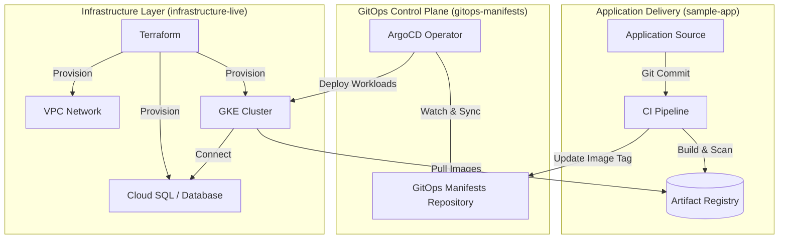

# Enterprise GitOps Platform Blueprint

## Introduction
This repository serves as the central architectural blueprint for an enterprise-grade GitOps platform. It provides a standardized framework for Infrastructure-as-Code (IaC), automated configuration management, and continuous delivery pipelines.

By implementing the GitOps methodology, this platform ensures that the entire system state—from cloud resources to application workloads—is version-controlled, auditable, and reproducible.

---

## System Architecture

The following diagram illustrates the high-level interaction between application development, infrastructure provisioning, and automated deployment.

## Repository Navigation

The platform is decomposed into specialized repositories to ensure separation of concerns and minimize the blast radius of changes.

| Repository | Responsibility | Key Technologies |
| :--- | :--- | :--- |
| **[gitops-platform-blueprint](./)** | Architectural Specification. Central documentation and system overview. | Markdown, Mermaid |
| [infrastructure-live](../infrastructure-live) | Infrastructure-as-Code. Provisioning of cloud resources (GKE, VPC, SQL). | Terraform, GCP, HCL |
| [gitops-manifests](../gitops-manifests) | Configuration Management. Declarative K8s resources and Helm charts. | ArgoCD, Helm, YAML |
| [sample-app](../sample-app) | Application Reference. Business logic and automated CI pipelines. | Kotlin, Quarkus, Docker |

---

## The GitOps Workflow

A standard feature release follows this automated lifecycle:

1. **Code Change**: Developers submit code to `sample-app`.
2. **Continuous Integration**: CI pipeline builds a container image, runs tests, and pushes the image to the Registry with a unique commit SHA.
3. **State Update**: The CI pipeline automatically updates the image tag in the `gitops-manifests` repository.
4. **Automatic Synchronization**: ArgoCD detects the discrepancy between the Git repository and the cluster state, then executes a rolling update to the GKE cluster.
5. **Infrastructure Stability**: Infrastructure changes are managed independently through `infrastructure-live` to ensure platform stability before application deployment.

## Design Principles

### 1. Single Source of Truth
The Git repository is the only source of truth for the system state. Any manual intervention in the cloud console or cluster is considered a "configuration drift" and will be automatically corrected by the GitOps operator.

### 2. Separation of Concerns
Infrastructure, environment configuration, and application source code are managed in separate lifecycles. This decoupling allows for independent scaling of teams and services while maintaining clear security boundaries.

### 3. Declarative Configuration
All resources are defined using declarative formats (HCL for Terraform, YAML for Kubernetes). This allows for deterministic deployments and simplified disaster recovery.

### 4. Security and Compliance
- **Secrets Management**: Sensitive data is managed via Cloud Secret Manager and injected into workloads at runtime.
- **Auditability**: Every change is tracked via Git history, providing a full audit trail of "who changed what and when."

---
**Document Version**: 1.0.0  
**Project Status**: Active / Reference Implementation
